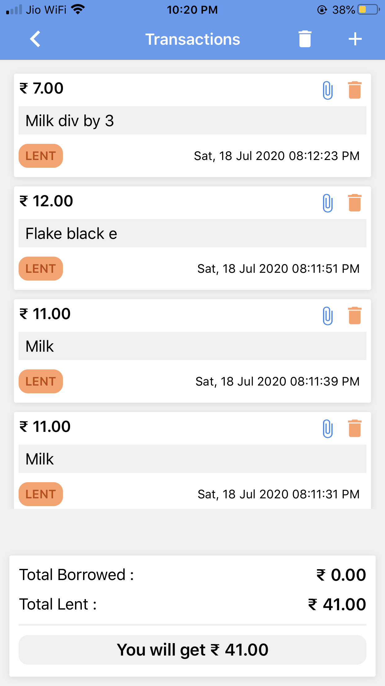
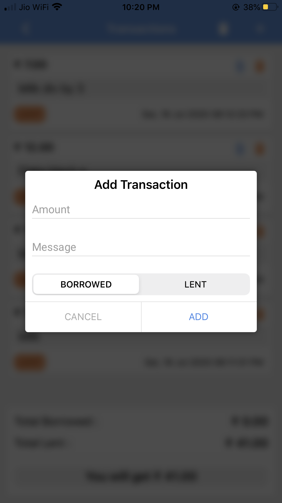

# friendly-money
Manage money with friends easily.Managing money with friends can be cumbersome sometimes. There are lot of apps out there which are too complex and advanced which you don't need most of the time.
So created this dead simple app to manage money (e.g: somebody paid my lunch fee or I paid his/her movie tickets price) to manage borrowed or lent money within friends circle.

## Screenshots

## Features
<ul>
<li>Add/Delete Friend</li>
<li>Add/Delete Transactions under a Friend</li>
<li>Add Attachment to a Transaction</li>
<li>Get summary for the Friend</li>
</ul>

## Libraries
Refer to the Podfile to see the used third party libraries

